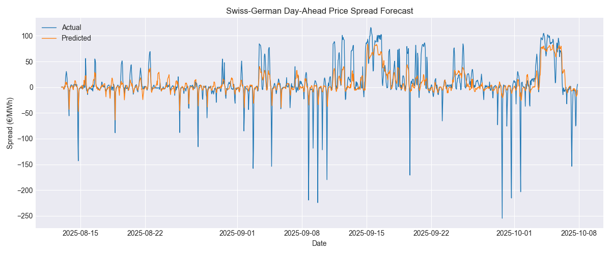
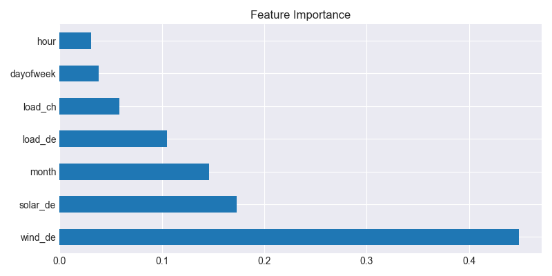

# Swiss-German Power Price Spread Forecasting

This project models and forecasts the day-ahead power price spread between Switzerland (CH) and Germany (DE) using public ENTSO-E data.

## Objective
To predict the hourly price spread (CH - DE) based on load and renewable generation forecasts.  
This spread reflects cross-border price differentials, which are critical for power trading and flow optimization.

## Data
- Source: ENTSO-E Transparency Platform
- Data used:
  - Day-ahead prices for CH and DE
  - Load forecasts for both countries
  - Solar and wind generation forecasts

## Methodology
1. Retrieve data using `entsoe-py`
2. Construct features: load forecasts, renewables, calendar variables
3. Train Random Forest Regressor to predict the hourly price spread
4. Evaluate with MAE and R²
5. Visualize predicted vs. actual spread

## Tools
Python, pandas, scikit-learn, matplotlib, entsoe-py

## Repository structure
power-spread-forecast/
├── data/
├── notebooks/
├── src/
├── README.md
├── requirements.txt
└── .gitignore

## Author
Nuno Poza - 2025

## Next steps
- Add model training module

## Latest Model Results (updated 2025-10-07 15:06:17)

| Metric | Value |
|---------|-------|
| MAE (€ / MWh) | 14.62 |
| R² | 0.511 |

### Figures

---
_Data source: ENTSO-E Transparency Platform | Model: RandomForestRegressor (200 trees)_
